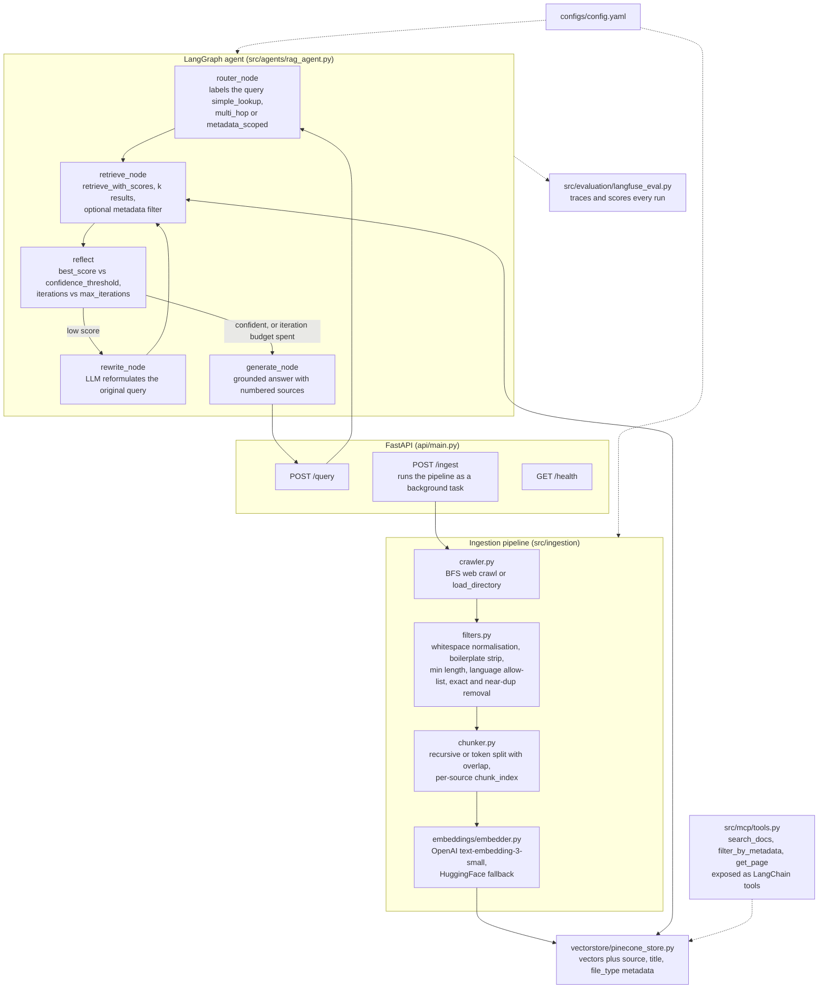

# Sage

Agentic RAG & semantic search over large documentation corpora, built with LangChain / OpenAI. A Python data pipeline crawls and cleans documents, embeds them with OpenAI and stores them in Pinecone with metadata, and a FastAPI service answers natural-language questions through a **LangGraph agent** that routes, retrieves and reasons iteratively, **self-reflects to re-query on low-confidence context**, and finally generates a grounded answer with source attribution. LangFuse traces and scores every run for evaluation and prompt optimization.

## Overview

- **Ingestion** — BFS web crawler + local-directory loader producing LangChain `Document`s with `source` / `title` / `file_type` metadata (`crawler.py`)
- **Cleaning filters** — whitespace normalisation, nav/boilerplate stripping, min-length gate, language allow-listing, exact + near-duplicate removal (`filters.py`)
- **Chunking** — recursive (and token) splitting with overlap; per-source `chunk_index` for citation/lookup (`chunker.py`)
- **Embeddings** — OpenAI `text-embedding-3-small` (HuggingFace fallback) (`embedder.py`)
- **Pinecone** — serverless index with metadata upserted alongside vectors for filtered retrieval (`pinecone_store.py`)
- **Retrieval** — MMR search + Pinecone metadata filtering, with scored variant for the confidence check (`retriever.py`)
- **MCP tools** — `search_docs`, `filter_by_metadata`, `get_page` as LangChain `@tool`s (`mcp/tools.py`)
- **Agent** — LangGraph `router → retrieve → reflect → (rewrite → retrieve …) → generate`, grounded answer with inline `[n]` source attribution (`agents/rag_agent.py`)
- **Evaluation** — LangFuse tracing + retrieval-recall / faithfulness / answer-relevance scoring for prompt optimization (`evaluation/langfuse_eval.py`)
- **FastAPI** — `/query`, `/ingest` (background), `/health`

## Tech Stack

Python 3.11 · LangChain · LangGraph · MCP · OpenAI · Pinecone · LangFuse · FastAPI · BeautifulSoup · langdetect

## Quickstart

```bash
pip install -r requirements.txt

export OPENAI_API_KEY=...
export PINECONE_API_KEY=...

CONFIG_PATH=configs/config.yaml uvicorn api.main:app --reload

# Ingest (crawl a docs site or load a local directory)
curl -X POST http://localhost:8000/ingest \
  -H "Content-Type: application/json" \
  -d '{"seeds": ["https://example.com/docs"], "max_pages": 2000}'

# Query (optionally scope with a metadata filter)
curl -X POST http://localhost:8000/query \
  -H "Content-Type: application/json" \
  -d '{"question": "How do I configure authentication?"}'

# Tests
pytest tests/
```

## Architecture



### The self-reflection loop



## Project Structure

```
sage/
├── src/
│   ├── ingestion/    # crawler.py, filters.py, chunker.py, pipeline.py
│   ├── embeddings/   # embedder.py (OpenAI)
│   ├── vectorstore/  # pinecone_store.py
│   ├── retrieval/    # retriever.py (MMR + metadata filter)
│   ├── mcp/          # tools.py (search_docs / filter_by_metadata / get_page)
│   ├── agents/       # rag_agent.py (LangGraph router + self-reflection)
│   └── evaluation/   # langfuse_eval.py
├── api/              # main.py (FastAPI)
├── configs/          # config.yaml
└── tests/            # pytest suite
```

## Tests

```bash
pytest tests/ -v
```

The offline suite covers the API-free logic: recursive chunking (size bounds, metadata + per-source `chunk_index` propagation) and the cleaning filters (whitespace/nav cleanup, length gate, exact + near-dup removal, language allow-listing). The OpenAI/Pinecone/LangGraph paths are exercised via the evaluation harness against live keys.

## Evaluation (RAG)

Run on a labelled `{question, gold_sources, gold_answer}` set (~50 questions over the seeded corpus).

| Metric | How to compute |
|---|---|
| **Retrieval Recall@k** | Fraction of `gold_sources` present in the top-k MMR results. `retrieval_recall()` in `langfuse_eval.py`. |
| **Faithfulness** | LLM judge over `(retrieved context, answer)`; % faithful. |
| **Answer relevance** | LLM judge over `(question, answer)`; mean + % ≥ 0.8. |
| **Citation precision** | Of the `[n]` sources cited, fraction actually in `gold_sources`. |
| **Re-query rate / lift** | Share of queries that triggered the self-reflection loop, and the recall/faithfulness delta after re-querying. |
| **Latency p50 / p99** | End-to-end `/query` time; LangFuse spans break out route / retrieve / generate. |
